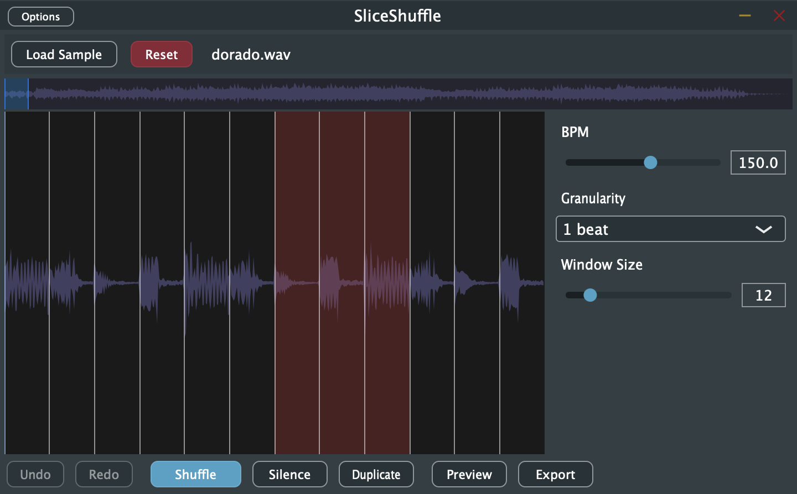

# SliceShuffle

SliceShuffle slices your audio (WAV, MP3, M4A) on a BPM grid and lets you shuffle the slices randomly. Use it as a **plugin** in your DAW or as a **command-line tool** for quick offline processing.



## What it does

- **Load** a sample (WAV, MP3, M4A, AIFF).
- **Detect BPM** automatically when you load a file, or set it yourself.
- **Slice** the audio into beats (with adjustable granularity: ¼, ½, 1, 2, or 4 beats per slice).
- **Shuffle** slices randomly, silence or duplicate parts, then **export** the result as WAV.

## Getting SliceShuffle

- **macOS / Windows:** Download the latest release from the [Releases](https://github.com/your-org/sliceshuffle/releases) page. Each release includes:
  - **SliceShuffle.vst3** — install this in your DAW’s VST3 folder.
  - **Standalone app** — run SliceShuffle without a DAW.

### Installing the plugin

- **macOS:** Copy `SliceShuffle.vst3` into `/Library/Audio/Plug-Ins/VST3/` (or `~/Library/Audio/Plug-Ins/VST3/` for your user only).
- **Windows:** Copy `SliceShuffle.vst3` into your VST3 folder (e.g. `C:\Program Files\Common Files\VST3`).

Your DAW will then list SliceShuffle in its plugin browser (VST3).

## Using the plugin (or Standalone app)

1. **Load a sample** — Click **Load Sample** and choose a WAV, MP3, M4A, or AIFF file. BPM is detected automatically; you can change it with the BPM slider.
2. **Adjust settings** — Set **Granularity** (slice size in beats) and **Window** (how many slices are visible and in play).
3. **Rearrange** — Use **Shuffle** to randomize the order of slices. Select specific slices (click/drag on the waveform) to shuffle only those, or use **Silence** / **Duplicate** on the selection.
4. **Preview** — Click **Preview** (or press Space) to hear the current arrangement.
5. **Export** — Click **Export** to save the current window as a WAV file. You can also drag from the waveform view into a DAW or folder to export.

**Reset** restores the slice order to the original.

## Using the command line

If you have the CLI build (e.g. from a release or from building the project), you can process files offline:

```bash
SliceShuffleCli input.wav output.wav --bpm 120
```

- **Input:** WAV, MP3, or M4A (M4A supported on macOS).
- **Output:** Always WAV.
- **Required:** `--bpm` — the BPM used for slicing (e.g. `--bpm 140`).

Example with an MP3:

```bash
SliceShuffleCli myloop.mp3 shuffled.wav --bpm 128
```

## System requirements

- **macOS** 10.14+ (VST3 + Standalone).
- **Windows** 10 or later (VST3 + Standalone).
- Any DAW or host that supports **VST3** (e.g. FL Studio, Reaper, Ableton Live, etc.).

## License

This project uses JUCE. Your use must comply with [JUCE’s license](https://juce.com/legal/juce-8-licence/) and any license applied to this codebase.
